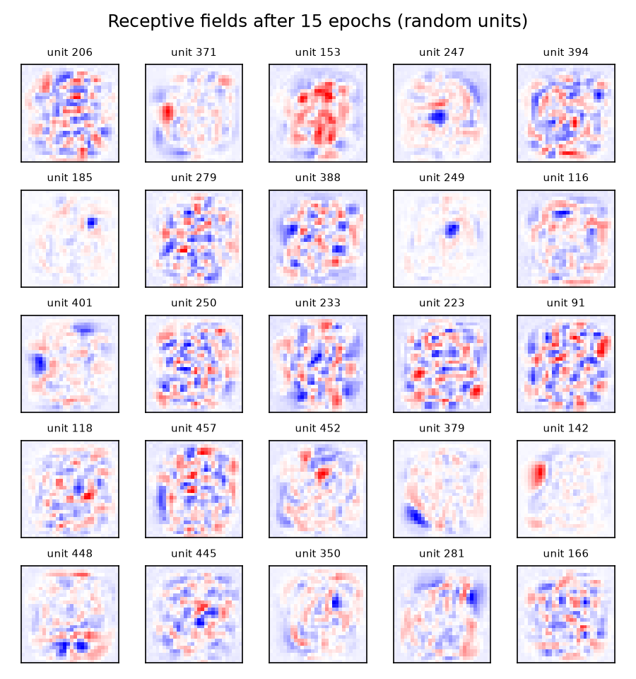
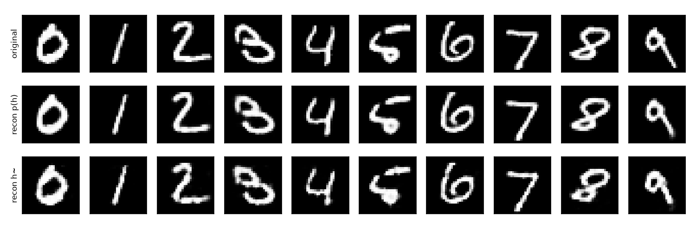

# Lab 4 – Restricted Boltzmann Machines and Deep Belief Networks

RBMs and a deep belief network (DBN) trained on MNIST, implemented in NumPy.

## Files

| File | Description |
|------|-------------|
| [`rbm.py`](rbm.py) | `RestrictedBoltzmannMachine`: contrastive divergence (CD-1) with momentum, plus directed recognition/generative weights for wake-sleep |
| [`dbn.py`](dbn.py) | `DeepBeliefNet`: greedy layer-wise pre-training, recognition (classification), generation, and wake-sleep fine-tuning |
| [`util.py`](util.py) | Sigmoid/softmax, sampling, MNIST idx loader, receptive-field plots, video stitching |
| [`run.py`](run.py) | Full pipeline: single RBM → greedy DBN → classification → digit generation → wake-sleep fine-tuning |
| [`experiments_rf_and_stack.py`](experiments_rf_and_stack.py) | Experiments on receptive fields and reconstructions (4.1 C) and the stacked 784-500-500 RBMs (4.2 A) |
| [`results/`](results/) | Figures and `summary.json` produced by the experiments script |
| [`generated_samples/`](generated_samples/) | Digits 0–9 generated by the DBN, before (`rbms.*`) and after (`dbn.*`) wake-sleep fine-tuning, plus receptive-field snapshots |

## Architecture

```
          [ top: 2000 ]            <- undirected RBM (associative memory)
       [ pen: 500 ] + [ lbl: 10 ]
          [ hid: 500 ]             <- directed recognition / generative weights
          [ vis: 784 ]             (28x28 MNIST image)
```

## Results

Reconstruction MSE on the test set after 15 epochs (`results/summary.json`):

| Model | Test MSE |
|-------|----------|
| RBM 784→500 | 0.0035 |
| RBM 500→500 (second layer) | 0.0044 |
| Full stack v → h₁ → h₂ → h₁ → v | 0.0067 |

| Receptive fields | Reconstructions |
|---|---|
|  |  |

## Running it

The MNIST files and trained weights are not in the repo because of their size. Download MNIST into this folder:

```bash
cd lab4-rbm-deep-belief-nets
for f in train-images-idx3-ubyte train-labels-idx1-ubyte t10k-images-idx3-ubyte t10k-labels-idx1-ubyte; do
  curl -O https://ossci-datasets.s3.amazonaws.com/mnist/$f.gz && gunzip $f.gz
done

python run.py                  # trains the RBM/DBN, saves weights to trained_rbm/ and trained_dbn/
python experiments_rf_and_stack.py   # regenerates results/
```

`dbn.py` reuses saved weights from `trained_rbm/` and `trained_dbn/` when they exist, so later runs skip training.
